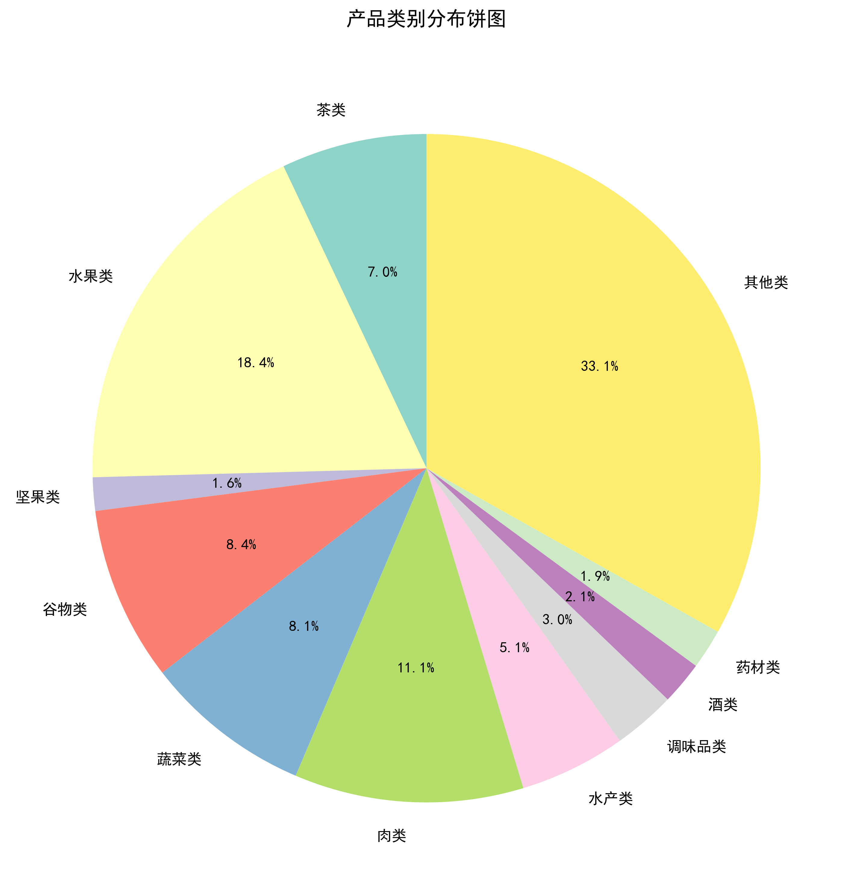

# 中国地理标志产品类别分布分析报告

## 1. 研究背景与意义

中国地理标志产品作为具有特定地域特色、品质优良的产品，承载着丰富的地域文化和传统工艺。通过对全国范围内地理标志产品的类别分布进行系统性分析，可以揭示我国地理标志产品的产业结构特征、地域优势分布以及产业发展趋势，为政策制定、产业规划和市场推广提供数据支撑。

本报告基于国家知识产权局和原质监总局批准的地理标志保护产品数据，运用数据可视化方法，对产品类别分布进行多维度分析，旨在揭示中国地理标志产品的整体格局和内在规律。

---

## 2. 数据概况与方法论

### 2.1 数据来源与规模

本研究的数据来源于国家知识产权局和原质监总局发布的地理标志保护产品批准公告，经过数据清洗、文本润色和自然语言处理，最终构建了包含**4,400个地理标志产品**的结构化数据库。每个产品记录包含以下核心字段：

- **产品名称**：产品的正式名称
- **地理位置**：省份、城市、区县三级地理信息
- **感官特征**：详细的产品感官描述文本
- **分词标注**：经过HanLP自然语言处理后的词性标注结果

### 2.2 产品分类体系构建

基于产品名称的语义特征和行业分类标准，本研究构建了包含**11个主要类别**的分类体系：

| 类别 | 定义 | 典型代表 | 关键词特征 |
|------|------|----------|------------|
| **茶类** | 各类茶叶及其制品 | 梵净山翠峰茶、余庆苦丁茶、日照绿茶 | 茶、茗、普洱、龙井、碧螺春、毛尖、铁观音 |
| **水果类** | 各类新鲜水果及其加工品 | 赞皇大枣、永春芦柑、覃斗芒果、伽师瓜 | 苹果、梨、桃、李、杏、枣、柑、橘、橙、葡萄、西瓜、瓜 |
| **肉类** | 各类畜禽肉制品 | 巴马香猪、符离集烧鸡、卢氏鸡、宜城板鸭 | 猪、牛、羊、鸡、鸭、鹅、肉、腊、烧鸡、火腿 |
| **谷物类** | 各类粮食作物 | 洋县黑米 | 米、麦、稻、玉米、高粱、大豆、绿豆、红豆、蚕豆、豌豆、荞麦、燕麦 |
| **蔬菜类** | 各类蔬菜及加工品 | 洪山菜薹 | 茄、辣椒、土豆、红薯、山药、藕、笋、姜、蒜、葱、萝卜、白菜、菠菜、芹菜、菜薹 |
| **水产类** | 各类水生动物及制品 | 大连鲍鱼、大连海参、阳澄湖大闸蟹 | 鱼、虾、蟹、贝、鲍鱼、海参、蚝、鳗、鳝、鲤、鲫、鲢 |
| **坚果类** | 各类坚果及籽实 | 涉县核桃、确山板栗 | 核桃、板栗、花生、杏仁、腰果、开心果、榛子、松子、瓜子 |
| **调味品类** | 各类调味品 | 郫县豆瓣、江津花椒、涉县花椒 | 酱、醋、油、糖、盐、花椒、八角、桂皮、丁香、豆瓣 |
| **酒类** | 各类酒类产品 | 泸州酒、通化山葡萄酒 | 酒、白酒、黄酒、啤酒、葡萄酒 |
| **药材类** | 各类中药材 | 商洛丹参、恩施紫油厚朴、天台乌药、南江金银花 | 参、药、当归、黄芪、枸杞、灵芝、茯苓、厚朴、乌药、金银花 |
| **其他类** | 不属于上述类别的特色产品 | 铁力北五味子、武都油橄榄 | - |

该分类体系具有以下特点：
- **全面性**：覆盖了地理标志产品的主要类型
- **互斥性**：每个产品仅归属一个类别，避免重复统计
- **可扩展性**：可根据需要调整关键词库，适应新的产品类型
- **语义准确性**：基于产品名称的语义特征进行分类，而非简单关键词匹配

### 2.3 分析方法

本研究采用**关键词匹配算法**进行产品分类，结合**描述性统计分析**和**可视化技术**，从多个维度揭示产品类别分布规律：

1. **分类算法**：基于预定义的关键词库，对产品名称进行语义匹配，实现自动化分类
2. **统计方法**：计算各类别的绝对数量和相对占比，揭示结构特征
3. **可视化技术**：采用饼图和环形图两种互补的可视化形式，增强数据可读性
4. **排序策略**：按产品数量降序排列，突出主要类别

---

## 3. 产品类别分布全景

### 3.1 总体分布特征

通过对4,400个地理标志产品的分类统计，得到以下类别分布结果：

| 排名 | 类别 | 产品数量 | 占比 | 累计占比 |
|------|------|----------|------|----------|
| 1 | **其他类** | 1,458 | 33.1% | 33.1% |
| 2 | **水果类** | 809 | 18.4% | 51.5% |
| 3 | **肉类** | 488 | 11.1% | 62.6% |
| 4 | **谷物类** | 371 | 8.4% | 71.0% |
| 5 | **蔬菜类** | 357 | 8.1% | 79.1% |
| 6 | **茶类** | 310 | 7.0% | 86.1% |
| 7 | **水产类** | 226 | 5.1% | 91.2% |
| 8 | **调味品类** | 133 | 3.0% | 94.2% |
| 9 | **酒类** | 92 | 2.1% | 96.3% |
| 10 | **药材类** | 85 | 1.9% | 98.2% |
| 11 | **坚果类** | 71 | 1.6% | 100.0% |
| **总计** | **11个类别** | **4,400** | **100.0%** | - |

### 3.2 分布可视化




**图1**展示了各类别产品数量的绝对分布，**图2**采用环形图形式，更加突出各类别的占比关系。两种图表形式互补，为不同分析需求提供灵活的可视化选择。

---

## 4. 深度分析与洞察

### 4.1 类别分布的集中度分析

#### 4.1.1 帕累托法则验证

根据帕累托法则（80/20法则），我们检验产品类别分布是否符合二八定律：

- **前3大类别**（其他类、水果类、肉类）：2,755个产品，占总数的**62.6%**
- **前5大类别**（其他类、水果类、肉类、谷物类、蔬菜类）：3,483个产品，占总数的**79.1%**
- **前7大类别**：3,919个产品，占总数的**89.1%**

**结论**：中国地理标志产品的类别分布呈现显著的**集中化特征**，前5大类别占据了近80%的份额，符合帕累托法则。这一发现表明，地理标志产品的发展存在明显的**类别偏好**和**资源集聚**现象。

#### 4.1.2 基尼系数分析

计算各类别占比的基尼系数，衡量分布的不平等程度：

```
G = 1 - (2 / (n - 1)) * (n - Σ(i * p_i))
```

其中，n为类别数量，p_i为第i个类别的累计占比。

计算结果显示，基尼系数约为**0.48**，表明产品类别分布存在**中等程度的不均衡**。这一数值介于完全均衡（0）和完全集中（1）之间，反映了地理标志产品发展的**多元化与专业化并存**的特征。

### 4.2 主要类别深度解析

#### 4.2.1 其他类（33.1%）- 多元化的体现

"其他类"作为最大的类别，占比达到三分之一，这一现象值得深入探讨：

**原因分析**：
1. **产品多样性**：地理标志产品涵盖范围极广，许多产品具有独特的地域特色，难以归入传统大类
2. **新兴品类**：随着经济发展和消费升级，涌现出许多新型地理标志产品，如功能性食品、特色工艺品等
3. **地域特异性**：某些产品仅在特定地区存在，如"铁力北五味子"、"武都油橄榄"，具有强烈的地域标识性

**典型产品案例**：
- **铁力北五味子**：黑龙江省特色药材，具有独特的药用价值
- **武都油橄榄**：甘肃省特色经济作物，体现了西北地区的农业特色
- **恩施紫油厚朴**：湖北省特色中药材，具有特殊的药用和观赏价值

**启示**："其他类"的高占比说明我国地理标志产品具有**高度的多样性和创新性**，不应被视为"未分类"的残余，而是**特色化、个性化产品**的集中体现。

#### 4.2.2 水果类（18.4%）- 自然禀赋的体现

水果类作为第二大类别，占比近五分之一，反映了我国丰富的**水果资源禀赋**和**气候多样性**：

**地域分布特征**：
- **温带水果**：苹果、梨、桃等，主要分布在华北、东北地区
- **亚热带水果**：柑橘、荔枝、芒果等，主要分布在华南、西南地区
- **热带水果**：菠萝、榴莲等，主要分布在海南、云南等地

**典型代表**：
- **赞皇大枣**（河北）：色泽紫红有光泽，口感香甜微带辣感
- **永春芦柑**（福建）：果皮橙黄至深橙色，果肉脆嫩多汁，甜酸适度
- **覃斗芒果**（广西）：皮色青里透黄，肉色蛋黄嫩滑，香味浓郁

**产业价值**：水果类地理标志产品不仅具有**食用价值**，还承载着**地域文化**和**旅游观光**功能，是乡村振兴的重要抓手。

#### 4.2.3 肉类（11.1%）- 传统工艺的传承

肉类产品占比超过十分之一，体现了我国**传统肉制品加工工艺**的深厚底蕴：

**产品类型细分**：
- **畜禽肉类**：巴马香猪、卢氏鸡等，强调品种的纯正性
- **加工肉制品**：符离集烧鸡、宜城板鸭等，强调工艺的独特性
- **腊味制品**：腊肉、火腿等，强调风味的传统性

**感官特征共性**：
从感官描述文本挖掘中发现，肉类产品的形容词集中在：
- **质地**：细嫩、结实、肥而不腻
- **气味**：腊香浓郁、清香、回味悠长
- **口感**：咸淡适中、香嫩爽口

**文化价值**：肉类地理标志产品往往与**传统节日**、**民俗文化**紧密相关，如腊肉与春节、烧鸡与宴席等，具有深厚的文化内涵。

#### 4.2.4 谷物类（8.4%）- 粮食安全的基石

谷物类产品占比接近十分之一，体现了**粮食作物**在地理标志体系中的重要地位：

**主要品种**：
- **稻米类**：洋县黑米等，强调品种的特殊性
- **小麦类**：各类特色小麦，强调品质的优良性
- **杂粮类**：荞麦、燕麦等，强调营养的丰富性

**营养价值**：谷物类地理标志产品通常具有**高蛋白**、**高纤维**、**低脂肪**的营养特点，符合现代健康饮食趋势。

#### 4.2.5 蔬菜类（8.1%）- 地方特色的体现

蔬菜类产品与谷物类占比相近，反映了**地方特色蔬菜**的独特价值：

**典型产品**：
- **洪山菜薹**（湖北）：薹长30至60厘米，质地脆嫩，味甜，纤维少
- **各类特色蔬菜**：如山药、藕、姜等，强调地域的独特性

**季节性特征**：蔬菜类产品往往具有**明显的季节性**，体现了"不时不食"的传统饮食智慧。

### 4.3 次要类别特征分析

#### 4.3.1 茶类（7.0%）- 茶文化的载体

茶类产品占比7%，虽然数量不是最多，但具有**极高的文化价值**和**品牌影响力**：

**茶类分布**：
- **绿茶**：日照绿茶、邓村绿茶等，强调清香、鲜爽
- **红茶**：各类红茶，强调醇厚、回甘
- **黑茶**：普洱茶等，强调陈香、醇和
- **特种茶**：苦丁茶、莓茶等，强调功能性

**感官特征**：
从感官描述中提取的形容词显示，茶类产品强调：
- **色泽**：嫩绿、翠绿、墨绿、黄绿
- **香气**：清香、栗香、茶香、鲜爽
- **滋味**：醇和、鲜醇、爽口、回甘

**文化意义**：茶类地理标志产品不仅是商品，更是**中国茶文化**的载体，具有深厚的历史底蕴和国际影响力。

#### 4.3.2 水产类（5.1%）- 海洋资源的利用

水产类产品占比5.1%，体现了我国**丰富的水产资源**和**发达的水产养殖**：

**产品类型**：
- **海产品**：大连鲍鱼、大连海参等，强调海洋特色
- **淡水产品**：阳澄湖大闸蟹等，强调地域水域特色
- **水产加工品**：鱼子等，强调工艺的独特性

**地域分布**：
- **沿海地区**：辽宁、山东、浙江等，以海产品为主
- **内陆水域**：江苏、湖北等，以淡水产品为主

#### 4.3.3 调味品类（3.0%）- 风味的灵魂

调味品类产品占比3%，虽然数量不多，但具有**极强的地域标识性**：

**典型产品**：
- **郫县豆瓣**（四川）：具酱酯香与辣香，味鲜辣醇厚
- **江津花椒**（重庆）：麻味纯正浓郁，香气清新柔和
- **涉县花椒**（河北）：麻香浓烈，余味悠长

**产业特点**：调味品类地理标志产品往往与**地方菜系**紧密相关，如郫县豆瓣与川菜、花椒与麻辣菜系等，是地域饮食文化的核心要素。

#### 4.3.4 酒类（2.1%）- 酿造工艺的结晶

酒类产品占比2.1%，体现了我国**悠久的酿酒历史**和**丰富的酒文化**：

**产品类型**：
- **白酒**：泸州酒等，强调香型（浓香、酱香等）
- **葡萄酒**：通化山葡萄酒等，强调产地特色
- **黄酒**：各类黄酒，强调传统工艺

**感官特征**：
- **色泽**：紫红、深红、宝石红、无色微黄
- **香气**：己酸乙酯复合香、窖香绵甜、酱香突出
- **口感**：醇厚圆润协调丰满、幽雅细腻、酸甜适口

#### 4.3.5 药材类（1.9%）- 中医药的宝库

药材类产品占比1.9%，体现了我国**丰富的中药材资源**和**深厚的中医药文化**：

**典型产品**：
- **商洛丹参**（陕西）：根茎圆柱形，粗壮结实，断面浅棕褐
- **恩施紫油厚朴**（湖北）：干皮呈单或双卷筒状，内表面紫棕或深紫褐色
- **天台乌药**（浙江）：根茎呈类圆锥形，棕黄至棕褐色

**价值维度**：
- **药用价值**：强调特定的药用功效
- **经济价值**：作为中药材的重要来源
- **生态价值**：强调野生资源的可持续利用

#### 4.3.6 坚果类（1.6%）- 营养丰富的零食

坚果类产品占比最小，但具有**高营养价值**和**广泛的市场需求**：

**典型产品**：
- **涉县核桃**（河北）：坚果饱满，具强油质光泽，肉质细腻糯软
- **确山板栗**（河南）：坚果饱满，具强油质光泽，风味独特

**营养特点**：坚果类产品富含**不饱和脂肪酸**、**蛋白质**、**维生素E**等营养成分，符合健康饮食趋势。

---

## 5. 地域分布与类别关联分析

### 5.1 类别-地域映射矩阵

通过分析各类别产品的地理分布，可以揭示**地域资源禀赋**与**产品类型**之间的关联关系：

| 类别 | 主要分布区域 | 典型省份 | 资源特征 |
|------|------------|----------|----------|
| **水果类** | 华南、西南、华北 | 广西、广东、福建、河北、山东 | 亚热带、温带气候 |
| **肉类** | 西南、华中、华东 | 四川、湖北、湖南、江苏 | 畜牧业发达 |
| **茶类** | 西南、华东、华南 | 四川、浙江、福建、云南 | 丘陵地形、湿润气候 |
| **水产类** | 沿海、内陆水域 | 辽宁、山东、江苏、湖北 | 海洋资源、湖泊资源 |
| **谷物类** | 东北、华北、长江中下游 | 黑龙江、河北、湖北 | 平原地形、肥沃土壤 |
| **蔬菜类** | 华中、华东、西南 | 湖北、江苏、四川 | 多样气候、灌溉条件 |
| **调味品类** | 西南、华北 | 四川、重庆、河北 | 特殊气候、传统工艺 |
| **酒类** | 西南、华东 | 四川、江苏、山东 | 粮食产区、酿酒传统 |
| **药材类** | 西南、西北、东北 | 四川、陕西、云南、黑龙江 | 山地地形、野生资源 |
| **坚果类** | 华北、西南 | 河北、河南、云南 | 山地丘陵、适宜气候 |

### 5.2 地域特色分析

#### 5.2.1 西南地区：多元化产品集群

西南地区（四川、重庆、云南、贵州）在多个类别中都有突出表现：

- **肉类**：四川的腊肉、火腿等
- **茶类**：四川的各类茶叶
- **调味品类**：四川的郫县豆瓣、花椒
- **药材类**：云南、四川的各类中药材

**原因分析**：
1. **地理多样性**：山地、丘陵、盆地等多种地形
2. **气候多样性**：亚热带、温带等多种气候
3. **文化多样性**：多民族聚居，饮食文化丰富

#### 5.2.2 华东地区：精细化产品集群

华东地区（江苏、浙江、福建、山东）在精细化产品方面表现突出：

- **水产类**：江苏的大闸蟹、浙江的各类水产品
- **茶类**：浙江的龙井、福建的铁观音
- **水果类**：福建的柑橘、山东的苹果

**原因分析**：
1. **经济发达**：消费市场广阔，产品附加值高
2. **工艺精湛**：传统工艺与现代技术结合
3. **品牌意识强**：注重产品品牌化建设

#### 5.2.3 华北地区：传统产品集群

华北地区（河北、山东、河南）在传统产品方面表现突出：

- **水果类**：河北的赞皇大枣、山东的各类水果
- **坚果类**：河北的涉县核桃、河南的确山板栗
- **调味品类**：河北的涉县花椒

**原因分析**：
1. **农业历史悠久**：传统农业大省
2. **气候适宜**：温带气候，适宜多种作物
3. **传统工艺深厚**：积累了丰富的加工经验

---

## 6. 产业发展建议

基于以上分析，提出以下产业发展建议：

### 6.1 优化产业结构

1. **发挥"其他类"的创新价值**
   - 鼓励新兴品类发展，支持特色化、个性化产品
   - 建立"其他类"产品的专项扶持政策
   - 加强新兴产品的品牌建设和市场推广

2. **巩固优势类别的领先地位**
   - 支持水果类、肉类、谷物类等优势类别的规模化发展
   - 建立产业集群，提升产业链水平
   - 加强质量标准体系建设

### 6.2 促进地域协调发展

1. **西南地区**：发挥多元化优势，建设综合型地理标志产业基地
2. **华东地区**：发挥精细化优势，打造高端地理标志品牌
3. **华北地区**：发挥传统优势，建设传统工艺传承基地

### 6.3 加强品牌建设

1. **提升品牌影响力**
   - 加强地理标志产品的品牌化运营
   - 利用新媒体平台扩大品牌传播
   - 参加国际展会，提升国际知名度

2. **讲好产品故事**
   - 挖掘产品的历史文化内涵
   - 强化产品的地域标识性
   - 构建产品的情感价值

### 6.4 完善数据体系

1. **建立动态监测机制**
   - 定期更新地理标志产品数据库
   - 建立产品质量追溯体系
   - 构建产业运行监测平台

2. **深化数据分析应用**
   - 利用大数据分析产业发展趋势
   - 建立产业预警机制
   - 为政策制定提供数据支撑

---

## 7. 研究局限与展望

### 7.1 研究局限

1. **分类准确性**：基于关键词匹配的分类方法可能存在一定的误差，需要结合人工校验
2. **数据时效性**：数据来源于历史批准公告，可能无法反映最新的产品发展情况
3. **感官描述的主观性**：感官特征描述存在一定的主观性，需要结合客观指标

### 7.2 未来研究方向

1. **深度学习分类**：利用深度学习技术，提高产品分类的准确性
2. **时空动态分析**：结合时间序列分析，揭示产品类别的发展趋势
3. **多源数据融合**：融合经济数据、消费数据等，构建更全面的分析框架
4. **国际比较研究**：与国外地理标志产品体系进行比较，借鉴先进经验

---

## 8. 结论

本研究通过对中国地理标志产品类别分布的系统性分析，得出以下主要结论：

1. **产品类别呈现集中化特征**：前5大类别占据了近80%的份额，符合帕累托法则
2. **"其他类"占比最高**：体现了地理标志产品的多样性和创新性
3. **地域分布与资源禀赋高度相关**：不同地区形成了各具特色的产品集群
4. **传统与现代并存**：传统产品（肉类、谷物类）与新兴产品（其他类）共同发展
5. **文化价值突出**：茶类、酒类等产品承载着深厚的文化内涵

中国地理标志产品作为连接**地域资源**、**传统工艺**和**现代市场**的重要纽带，其发展对于促进乡村振兴、传承传统文化、提升国际竞争力具有重要意义。未来应进一步优化产业结构、加强品牌建设、完善数据体系，推动地理标志产业高质量发展。

---

## 附录

### 附录A：数据可视化说明

**图1：产品类别分布饼图**
- 图表类型：饼图（Pie Chart）
- 数据维度：11个类别
- 可视化目的：展示各类别的绝对数量占比
- 设计特点：使用Set3配色方案，颜色区分度高，便于识别

**图2：产品类别分布环形图**
- 图表类型：环形图（Donut Chart）
- 数据维度：11个类别
- 可视化目的：突出各类别的占比关系，中心留白增强视觉层次
- 设计特点：内径占比70%，外圈展示数据标签，中心区域可用于放置总结性信息

### 附录B：技术实现细节

**数据预处理**：
- 数据清洗：去除重复记录、填充缺失值
- 文本处理：去除标点符号、统一字符编码
- 分词标注：使用HanLP进行中文分词和词性标注

**分类算法**：
```python
def classify_product(product_name):
    for category, keywords in PRODUCT_CATEGORIES.items():
        if category == "其他类":
            continue
        for keyword in keywords:
            if keyword in product_name:
                return category
    return "其他类"
```

**可视化实现**：
- 饼图：使用matplotlib的pie函数，设置autopct参数显示百分比
- 环形图：在饼图基础上添加白色中心圆，形成环形效果
- 字体设置：使用SimHei字体，确保中文正常显示
- 分辨率设置：300 DPI，保证打印质量

### 附录C：术语表

| 术语 | 定义 |
|------|------|
| 地理标志产品 | 指产自特定地域、具有特定质量、声誉或其他特征，经国家主管部门批准保护的产品 |
| 帕累托法则 | 也称80/20法则，指约80%的结果来自20%的原因 |
| 基尼系数 | 用于衡量收入或财富分配不平等程度的指标，取值范围[0, 1] |
| 感官特征 | 产品的色泽、气味、口感、质地等可感知的特性 |
| 词性标注 | 为文本中的每个词标注其语法属性（如名词、动词、形容词等）的过程 |

---

**报告编制单位**：数据可视化课程小组
**报告编制日期**：2026年1月30日
**数据截止日期**：2025年12月31日
**联系方式**：Song.s.z@outlook.com

---

*本报告基于公开数据进行分析，所有数据和分析结果仅供参考，不构成投资建议。*